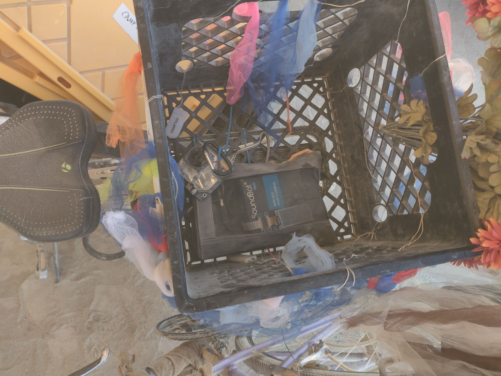
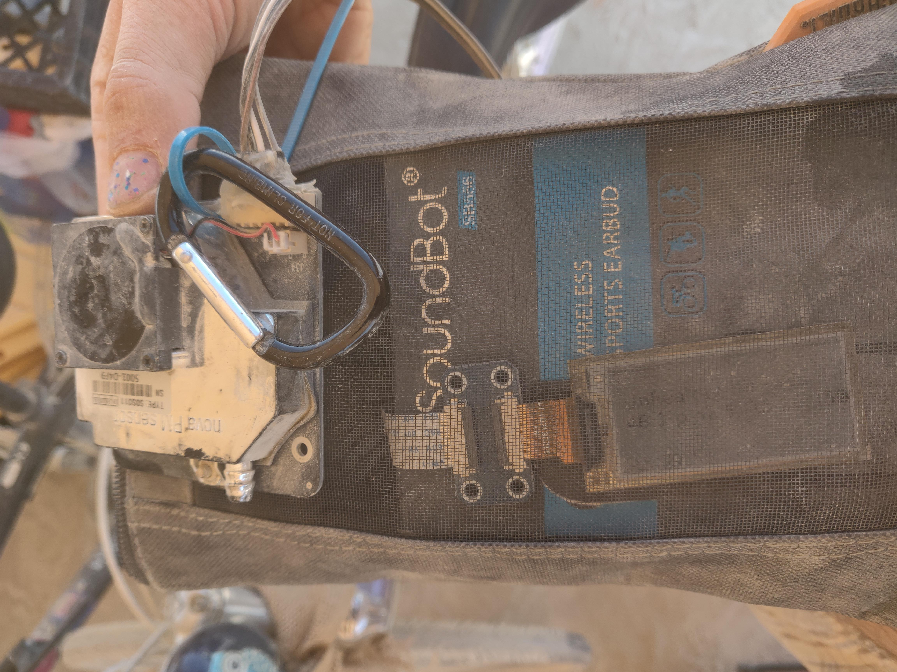

## Visualizations 

- [Map Timeline](https://ssuffian.github.io/hotlouddusty-data/map.html)
- [Zoomable/Brushable Time Series Plot](https://ssuffian.github.io/hotlouddusty-data/timeseries.html)
- [Jupyter Notebook](https://nbviewer.jupyter.org/github/ssuffian/hotlouddusty-data/blob/master/ipynb/initial_analysis.ipynb)


## Description

This repository contains scripts for analyzing particular matter data collected at Burning Man in 2019 using code from [this repository](https://github.com/ssuffian/hotlouddusty), which was installed on a Raspberry Pi Zero connected to a RTC and an SDS-011 PM2.5/10 sensor. 

```
data
├────dust
│    └───dusty.csv
├────weather
│    └───gerlack_weather.csv
├────gps
│    └───*.gpx
└────bm2019_pm_data.csv
README.md
combine_data.py
get_weather.py
```

## Weather Data

Fetching Weather data requires a weather underground API key. You can sign up for one if you have a weather station, then use `get_weather.py` to get weather data. You will need to load the api key as an environment variable like so (if your api key was 1234567890):

        export WEATHER_COM_API_KEY=1234567890

However the data from Gerlach for Burning Man 2019 has already been fetched and is in `data/weather/gerlach_weather.csv`.

## Map Timeline

This visualization is derived (with minimal edits) from Leaflet.Timeline's [Earthquake](http://skeate.github.io/Leaflet.timeline/earthquakes.html) example. It requires that the air quality data (`data/dust/dusty.csv`) and GPS data (`data/gps/*.gpx`) has been merged and subsequently converted to geojson format and stored in the `data` directory when running the `python combine_data.py` command.

The `leaflet.timeline.js` file was compiled using [this repo](https://github.com/skeate/Leaflet.timeline), with an updated package.json that can be found in `leaflet/leaflet-timeline-package.json`.

        git clone https://github.com/skeate/Leaflet.timeline.git
        cp leaflet/leaflet-timeline-package.json Leaflet.timeline/package.json 
        cd Leaflet.timeline
        npm install
        npm run build
        cp dist/leaflet.timeline.js ../leaflet/
        
Photos
------
      

Information around Air Quality
------------------------------

[World Health Organization Air Quality Guidelines](https://www.who.int/news-room/fact-sheets/detail/ambient-(outdoor)-air-quality-and-health)

### Fine Particulate Matter (PM2.5)

- 10 μg/m3 annual mean
- 25 μg/m3 24-hour mean

### Coarse Particulate Matter (PM10)

- 20 μg/m3 annual mean
- 50 μg/m3 24-hour mean

[EPA Air Quality Guidelines](https://www.epa.gov/sites/production/files/2016-04/documents/overview_factsheet.pdf)

### Fine Particulate Matter (PM2.5)

- 12 μg/m3 annual mean
- 35 μg/m3 24-hour mean

### Coarse Particulate Matter (PM10)

- 150 μg/m3 24-hour mean

Other Articles
--------------

- [Does the US have the world's cleanest air? No, it's getting dirtier](https://www.businessinsider.com/does-the-us-have-the-cleanest-air-in-the-world-2018-10)

Contributors
------------

- [Stephen Suffian](https://github.com/ssuffian)
- [Chris Ballinger](https://github.com/chrisballinger)

This work is derived from
-------------------------
- [d3 Brush and Zoom](https://bl.ocks.org/mbostock/34f08d5e11952a80609169b7917d4172)
- [Leaflet Timeline 1.2.1](https://github.com/skeate/Leaflet.timeline)
- [Leaflet (v1.2.0)](https://github.com/Leaflet/Leaflet)

To Do
-----
- Link to wind data from Black Rock Airport.
- Link to photos for visual dust confirmation.
- Fix timezone on map.

[Link to GitHub Pages Page](https://ssuffian.github.io/hotlouddusty-data/)
